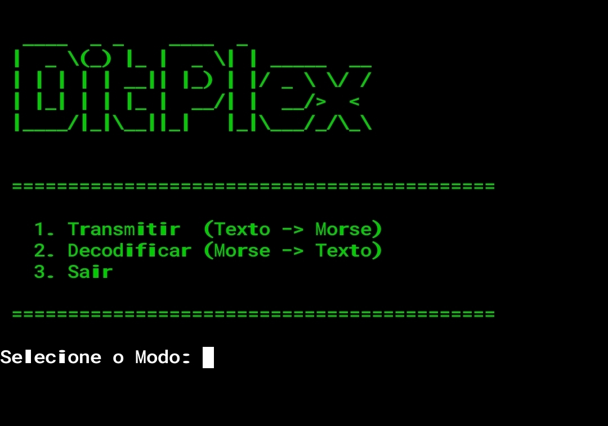

  

  # DitPlex

  **CLI Morse Academy • Transmissor e Decodificador em Linha de Comando**

 

---

## Sobre

O **DitPlex** é uma ferramenta de linha de comando leve voltada para a conversão entre texto e Código Morse.

## Funcionalidades

- **Tradução Bidirecional:**
  - **Texto ➔ Morse:** Converte palavras do alfabeto latino para sequências de pontos (`.`) e traços (`-`).
  - **Morse ➔ Texto:** Traduz sequências em Morse organizadas de volta para caracteres de texto.
- **Regras de Espaçamento:**
  - Separador de caracteres: Espaço simples (` `).
  - Separador de palavras: Barra (`/`).

## Preview

---

## Futuras Implementações

- [ ] **Sinais Sonoros:** Reprodução de áudio dos impulsos de frequência para cada ponto e traço.
- [ ] **Exportação de Arquivos:** Salvamento automático das traduções em arquivos de texto `.txt`.
- [ ] **Modo de Aprendizado:** O projeto ainda não possui um módulo de treinamento. Caso haja interesse da comunidade, essa função poderá ser desenvolvida no futuro.

---

## Compilação e Build

O repositório inclui o script `build.py` para automatizar a geração do executável. O utilitário utiliza um ambiente virtual isolado para remover dependências desnecessárias do Python global e minimizar o tamanho do arquivo final.

### Como usar?
- use --help para obter a forma correta de usar
- Python 3.x instalado

---

## Licença

* O **código-fonte** deste projeto está licenciado sob a [Licença MIT](LICENSE).
* Os **ativos visuais, marca e design** do projeto **DitPlex** estão protegidos sob [Todos os Direitos Reservados](LICENSE-ASSETS.md).
