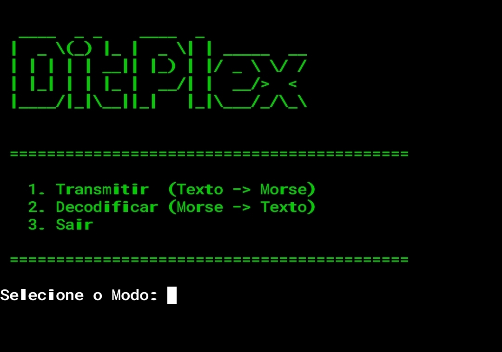

  

  # DitPlex

  **CLI Morse Academy • Transmissor e Decodificador em Linha de Comando**

(LICENSE)

---

## Sobre

O **DitPlex** é uma ferramenta de linha de comando leve para conversão entre texto e Código Morse — sem depender de sites ou apps externos, direto no seu terminal.

## Funcionalidades

- **Tradução Bidirecional:**
  - **Texto ➔ Morse:** Converte palavras do alfabeto latino para sequências de pontos (`.`) e traços (`-`).
  - **Morse ➔ Texto:** Traduz sequências em Morse organizadas de volta para caracteres de texto.
- **Regras de Espaçamento:**
  - Separador de caracteres: Espaço simples (` `).
  - Separador de palavras: Barra (`/`).

## Preview

---

## Instalação

Baixe o executável para o seu sistema direto na aba **[Releases](../../releases)** do repositório:

- **Windows:** `.exe` pronto para uso
- **Linux:** pacotes `.deb`, `.rpm`, `.tar` (Arch) ou Flatpak

Nenhuma instalação de Python é necessária ao usar os binários pré-compilados.

## Como usar

- Use `--help` para ver a forma correta de utilizar o comando.
- Requer Python 3.x instalado apenas se for rodar a partir do código-fonte.

---

## Futuras Implementações

- [ ] **Sinais Sonoros:** Reprodução de áudio dos impulsos de frequência para cada ponto e traço. *(previsto para v1.6.0)*
- [ ] **Exportação de Arquivos:** Salvamento automático das traduções em arquivos de texto `.txt`.
- [ ] **Prosigns:** Suporte a sinais processuais do Morse (SOS, AR, SK, entre outros), com opção para consultar o significado de cada um.
- [ ] **Ajuste de Velocidade (WPM):** Simulação do Morse em diferentes velocidades de transmissão.
- [ ] **Modo de Aprendizado:** O projeto ainda não possui um módulo de treinamento. Caso haja interesse da comunidade, essa função poderá ser desenvolvida no futuro.

---

## Compilação e Build

Para compilar a partir do código-fonte, o repositório inclui o script `build.py`, que automatiza a geração do executável usando um ambiente virtual isolado — isso remove dependências desnecessárias do Python global e reduz o tamanho do arquivo final.

---

## Licença

- O **código-fonte** deste projeto está licenciado sob a [Licença MIT](LICENSE).
- Os **ativos visuais, marca e design** do projeto **DitPlex** estão protegidos sob [Todos os Direitos Reservados](LICENSE-ASSETS.md).